# AquaTogo Manager

Application web interne de gestion pour une boutique d'aquariophilie (Togo).  
Outil métier **mobile-first** pensé pour un vendeur qui travaille depuis sa boutique avec son smartphone.

---

## Sommaire

1. [Présentation](#présentation)
2. [Stack technique](#stack-technique)
3. [Installation & lancement](#installation--lancement)
4. [Navigation dans l'application](#navigation-dans-lapplication)
5. [Modules — guide utilisateur](#modules--guide-utilisateur)
   - [Tableau de bord](#-tableau-de-bord)
   - [Produits & Stock](#-produits--stock)
   - [Prestations d'entretien](#-prestations-dentretien)
   - [Ventes](#-ventes)
   - [Clients](#-clients)
   - [Dépenses](#-dépenses)
   - [Rappels de renouvellement](#-rappels-de-renouvellement)
6. [Résumé automatique Telegram](#résumé-automatique-telegram)
7. [Structure du projet](#structure-du-projet)

---

## Présentation

AquaTogo Manager est un outil de gestion interne conçu pour une boutique aquariophile au Togo. Il centralise :

- la gestion du **stock** (poissons & accessoires)
- la gestion des **ventes** avec calcul automatique des marges et du bénéfice
- le suivi des **prestations d'entretien** avec rappels automatiques
- la **relation client** (historique, dettes, contact WhatsApp)
- une **mini-comptabilité** (dépenses, bénéfice net)
- un **résumé quotidien/hebdomadaire** envoyé par Telegram

> Ce n'est **pas** un e-commerce public. L'accès est réservé au(x) vendeur(s) authentifié(s).

---

## Stack technique

| Couche | Technologie |
|--------|-------------|
| Backend | Django 6 + PostgreSQL |
| Frontend | Django Templates + Tailwind CSS v3 + Alpine.js (CDN) |
| Graphiques | Chart.js 4 (CDN) |
| Images produits | Pillow → `media/products/` |
| Fichiers statiques | WhiteNoise (prod) |
| Notifications | Telegram Bot API |

---

## Installation & lancement

### Prérequis

- Python 3.12+
- Node.js 18+
- PostgreSQL

### Étapes

```bash
# 1. Cloner le projet
git clone <url-du-repo>
cd aqua_togo_manager

# 2. Environnement Python
python -m venv venv
source venv/bin/activate          # Windows : venv\Scripts\activate
pip install -r requirements.txt

# 3. Variables d'environnement
cp .env.example .env              # compléter DATABASE_URL, SECRET_KEY, etc.

# 4. Base de données
python manage.py migrate

# 5. Superutilisateur
python manage.py createsuperuser

# 6. Dépendances CSS
npm install
```

### Lancer en développement

```bash
# Terminal 1 — serveur Django
python manage.py runserver

# Terminal 2 — compilation Tailwind (watch)
npm run dev
```

### Build production

```bash
npm run build
python manage.py collectstatic
```

L'application est accessible sur `http://127.0.0.1:8000/`.

---

## Navigation dans l'application

### Sur mobile (smartphone)

L'interface mobile dispose d'une **barre de navigation en bas de l'écran** avec 5 accès rapides :

```
┌──────────────────────────────────────────────┐
│  [Accueil]  [Produits]  [+ Vente]  [Clients]  [Profil]  │
└──────────────────────────────────────────────┘
```

- **Accueil** — Tableau de bord
- **Produits** — Liste & gestion du stock
- **[+]** (bouton central bleu) — Créer une nouvelle vente directement
- **Clients** — Liste des clients
- **Profil** — Compte utilisateur

> Un menu hamburger (☰) en haut à gauche ouvre la sidebar complète.

### Sur ordinateur (desktop)

Une **sidebar fixe à gauche** (264 px) affiche la navigation complète :

```
┌─────────────────────┐
│ 🐟 AquaTogo         │
├─────────────────────┤
│ GÉNÉRAL             │
│  Tableau de bord    │
├─────────────────────┤
│ STOCK & VENTES      │
│  Produits           │
│  Prestations        │
│  Ventes             │
├─────────────────────┤
│ RELATION CLIENT     │
│  Clients            │
│  Rappels            │
├─────────────────────┤
│ FINANCE             │
│  Dépenses           │
├─────────────────────┤
│ [avatar] username   │
│            [logout] │
└─────────────────────┘
```

---

## Modules — guide utilisateur

### Tableau de bord

> **URL :** `/`

Le tableau de bord est la page d'accueil après connexion. Il donne une vue complète de l'activité en un coup d'œil.

#### Ce qu'on voit

**Chiffre d'affaires & Bénéfice** (3 colonnes)

| Aujourd'hui | Semaine | Ce mois |
|-------------|---------|---------|
| CA + Bénéfice du jour | CA + Bénéfice de la semaine | CA + Bénéfice brut + Net (après dépenses) |

**Graphique d'évolution (30 jours)**  
Courbe du CA et du bénéfice quotidien sur les 30 derniers jours.

**Alertes & Rappels**

- Bannière orange si des prestations sont prévues **demain** → lien direct vers les rappels
- Compteur rouge si des ventes sont **impayées**

**Alertes stock faible**  
Liste rouge des produits en rupture ou en stock critique.

**Prochaines prestations**  
Liste des entretiens à venir, avec badge coloré :
- `Aujourd'hui` (jaune), `Dans Xj` (jaune), `En retard` (rouge), date (bleu)

**Top produits & Top prestations du mois**  
Classement des produits les plus vendus et des prestations les plus réalisées.

> **Astuce :** Sur desktop, un bouton flottant `+` en bas à droite permet de créer une vente directement depuis le tableau de bord.

---

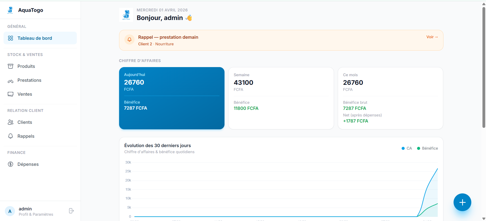 

---

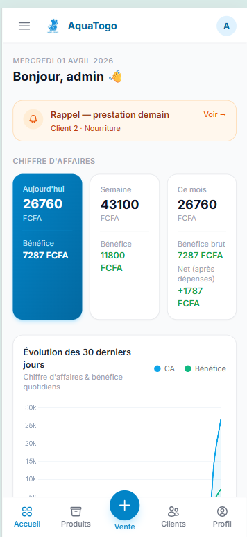 


---

### Produits & Stock

> **URL :** `/produits/`

Gestion de l'ensemble du catalogue : **poissons** et **accessoires**.

#### Liste des produits

- Filtrage par catégorie (Poissons / Accessoires) et par statut de stock
- Barre de recherche par nom
- Chaque produit affiche : photo (ou placeholder), nom, catégorie, prix de vente, stock, marge
- Badge coloré : `Rupture` (rouge) / `Stock faible` (jaune) / stock OK (vert)

#### Ajouter / Modifier un produit

Champs disponibles :

| Champ | Description |
|-------|-------------|
| Nom | Nom du produit |
| Catégorie | `Poisson` ou `Accessoire` |
| Prix d'achat | Coût de revient (FCFA) |
| Prix de vente | Prix affiché (FCFA) |
| Stock actuel | Quantité disponible |
| Stock minimum | Seuil d'alerte stock faible |
| Photo | Image du produit (optionnel) |
| Description | Notes internes |

La **marge** (FCFA et %) est calculée automatiquement : `prix vente − prix achat`.

#### Mouvements de stock

Le stock se met à jour **automatiquement** à chaque vente (décrémentation) ou peut être ajusté manuellement via le formulaire produit.

---

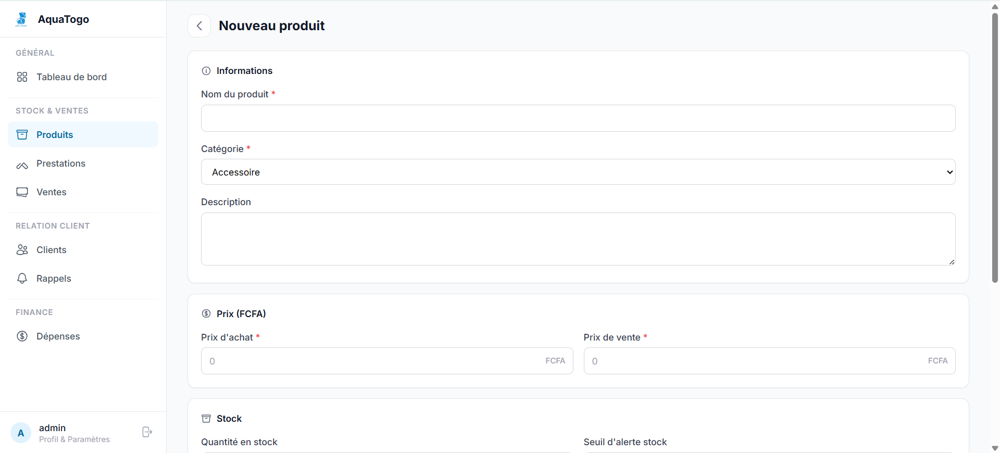 

---

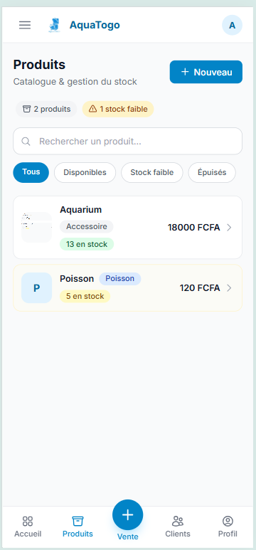 
---

### Prestations d'entretien

> **URL :** `/prestations/`

Gestion des services proposés aux clients : nettoyage d'aquarium, installation, maintenance, etc.

#### Catalogue des prestations

- Liste de tous les services avec nom, prix, délai de renouvellement
- Indicateur `Ponctuel` ou `Tous les X jours / semaines / mois`

#### Créer une prestation (catalogue)

| Champ | Description |
|-------|-------------|
| Nom | Ex. : "Nettoyage complet" |
| Description | Détail du service |
| Prix | Tarif (FCFA) |
| Délai de renouvellement | Vide = ponctuel, sinon nombre de jours |

#### Historique des exécutions

> **URL :** `/prestations/executions/`

Chaque fois qu'un service est réalisé pour un client, une **exécution** est enregistrée avec :
- Client concerné
- Date d'exécution
- Date de prochain renouvellement (calculée automatiquement)
- Heure prévue du rendez-vous (optionnel)
- Statut : confirmé / complété / en attente

La vue peut être filtrée par **jour**, **semaine** ou **mois**, et affichée en format **calendrier** ou **liste**.

> **Règle métier :** Si une prestation a un délai de renouvellement défini, la `prochaine date` est calculée automatiquement : `date d'exécution + délai en jours`.

---


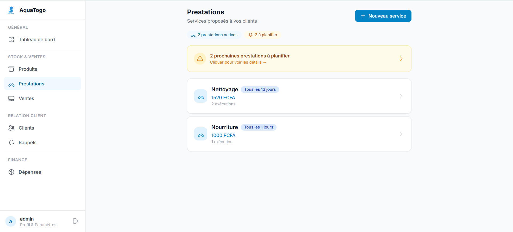 


---

### Ventes

> **URL :** `/ventes/`

Module central de l'application. Chaque vente peut contenir des **produits** et/ou des **services**.

#### Créer une vente

1. Appuyer sur **[+]** (bouton central mobile) ou `Nouvelle vente` (desktop)
2. Sélectionner ou créer un client
3. Ajouter des lignes :
   - Produit : sélectionner dans le catalogue → le prix et la marge sont pré-remplis
   - Service : sélectionner la prestation → une exécution est créée automatiquement
4. Modifier les quantités
5. Valider

Le total est recalculé automatiquement à chaque modification.

#### Liste des ventes

- Filtrage par période : **Jour / Semaine / Mois**
- Chaque ligne affiche : date, client, nombre d'articles, montant total, statut de paiement
- Statuts de paiement :
  - `Payé` (vert)
  - `Partiel` (jaune)
  - `Impayé` (rouge)

#### Détail d'une vente

- Vue complète des lignes (produit/service, quantité, prix unitaire, total)
- Bénéfice estimé sur la vente
- Historique des paiements reçus
- Bouton `Ajouter un paiement` pour enregistrer un règlement partiel ou total

#### Statut de paiement (automatique)

Le statut est mis à jour automatiquement à chaque paiement enregistré :

```
Impayé  →  Partiel  →  Payé
 (0%)       (1–99%)    (100%)
```

---

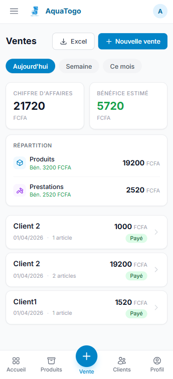 

---

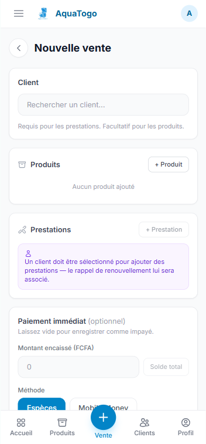 

---

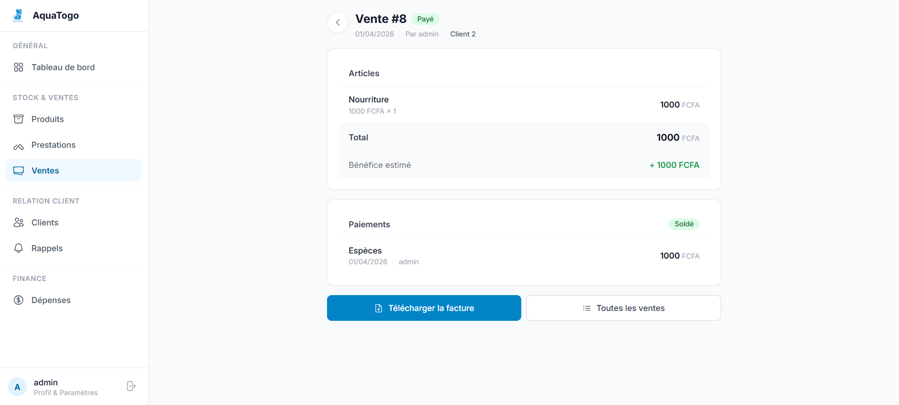 

---

### Clients

> **URL :** `/clients/`

Gestion de la base client de la boutique.

#### Liste des clients

- Recherche par nom ou téléphone
- Indicateur visuel pour les clients avec **solde impayé** (dette)
- Affichage du montant total dépensé par client

#### Fiche client

Chaque fiche contient :

| Section | Contenu |
|---------|---------|
| Informations | Nom, téléphone, date d'ajout |
| Solde | Montant total facturé − total payé |
| Historique achats | Toutes les ventes liées |
| Historique prestations | Toutes les exécutions de service |
| Contact rapide | Lien WhatsApp direct (si numéro renseigné) |

#### Créer / modifier un client

Champs : Nom, Téléphone (format international recommandé pour WhatsApp).

---


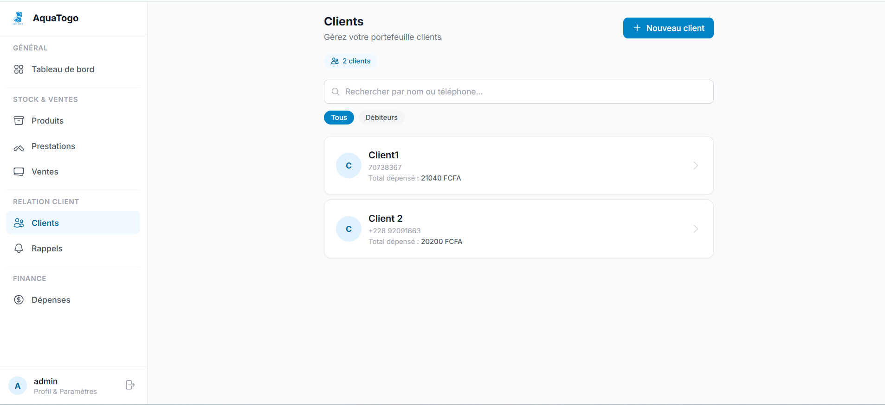 

---

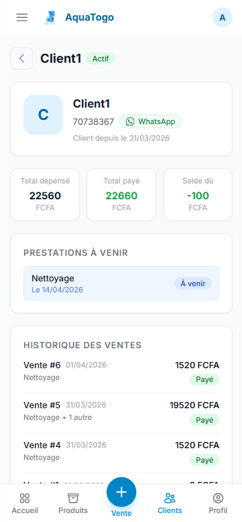 

---

### Dépenses

> **URL :** `/depenses/`

Mini-comptabilité pour enregistrer les sorties d'argent de la boutique.

#### Catégories de dépenses

| Catégorie | Exemples |
|-----------|---------|
| `Stock` | Achat de poissons, accessoires |
| `Transport` | Livraisons, déplacements |
| `Équipement` | Matériel de nettoyage, pompes |
| `Charges` | Électricité, eau, loyer |
| `Autre` | Divers |

#### Saisir une dépense

Champs : Date, Catégorie, Montant (FCFA), Description.

#### Vue récapitulative

- Total des dépenses du mois par catégorie
- Impact sur le **bénéfice net** visible sur le tableau de bord

---

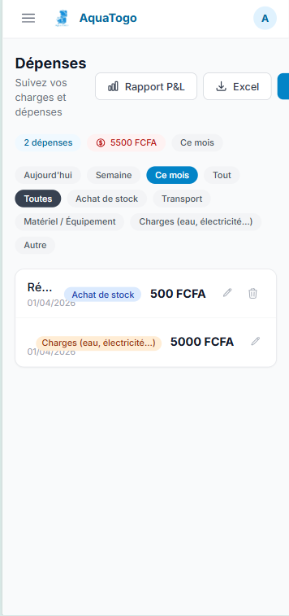 

---

### Rappels de renouvellement

> **URL :** `/prestations/executions/`

Vue dédiée aux **prochaines interventions** à planifier ou confirmer.

#### Fonctionnement

Chaque prestation avec un délai de renouvellement génère automatiquement une date de prochain passage. Cette vue liste toutes les exécutions à venir, filtrables par période.

#### Codes couleur des badges

| Badge | Signification |
|-------|--------------|
| `En retard` (rouge) | La date est dépassée, non complété |
| `Aujourd'hui` (jaune) | Prévu pour aujourd'hui |
| `Dans Xj` (jaune) | Prévu dans moins de 7 jours |
| Date (bleu) | Prévu dans plus de 7 jours |
| `Complété` (vert) | Intervention réalisée |

#### Vue calendrier

La liste peut être affichée en vue **jour**, **semaine** ou **mois** pour une meilleure planification.

> **Alerte J-1 :** Le tableau de bord affiche une bannière orange la veille de chaque intervention.

---

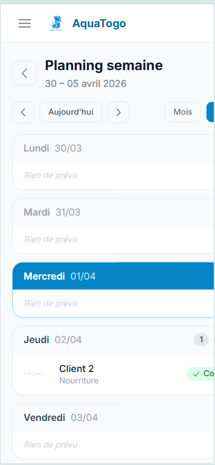 

---

## Résumé automatique Telegram

Un résumé des ventes peut être envoyé automatiquement par **Telegram Bot** (quotidien ou hebdomadaire).

**Exemple de message reçu :**

```
📊 Résumé des ventes – 01 Avril 2026

🛍 Produits   : 120 000 FCFA
🛠 Services   : 30 000 FCFA
💰 Total      : 150 000 FCFA
📈 Bénéfice   : 45 000 FCFA
```

**Configuration :**

1. Créer un bot Telegram via `@BotFather` et récupérer le token
2. Ajouter dans `.env` :
   ```
   TELEGRAM_BOT_TOKEN=<votre-token>
   TELEGRAM_CHAT_ID=<votre-chat-id>
   ```
3. Planifier la commande Django :
   ```bash
   python manage.py send_alerts
   ```
   Via cron (Linux) ou Task Scheduler (Windows) pour l'automatisation.

---

## Structure du projet

```
aqua_togo_manager/
├── config/               # Settings Django, urls racine
├── core/                 # Auth, dashboard, UserProfile, alertes
├── products/             # Produits (poissons & accessoires), stock
├── services/             # Prestations, exécutions, calendrier
├── clients/              # Clients, historique, dettes
├── sales/                # Ventes (Sale + SaleItem + Payment)
├── accounting/           # Dépenses (Expense)
├── templates/            # Tous les templates HTML
│   ├── base.html         # Layout principal (sidebar + bottom nav)
│   ├── partials/         # Composants réutilisables
│   ├── core/             # Dashboard, profil
│   ├── products/         # Liste, formulaire, détail
│   ├── services/         # Liste, formulaire, exécutions, calendrier
│   ├── sales/            # Liste, création, détail
│   ├── clients/          # Liste, formulaire, détail
│   └── accounting/       # Liste des dépenses
├── static/
│   ├── css/              # output.css (Tailwind compilé)
│   └── img/              # logo.png
├── media/                # Images produits (runtime)
├── manage.py
├── requirements.txt
├── package.json          # Scripts Tailwind (dev / build)
└── tailwind.config.js
```

---

## Montants & devises

Tous les montants sont en **FCFA** (Franc CFA ouest-africain).  
Stockés en `DecimalField` pour éviter les erreurs d'arrondi sur les calculs de marge et de bénéfice.

---

## Sécurité

- Authentification Django requise sur toutes les pages (redirection vers `/login/`)
- CSRF activé sur tous les formulaires POST (dont la déconnexion)
- HTTPS recommandé en production
- Accès admin Django disponible sur `/admin/`
